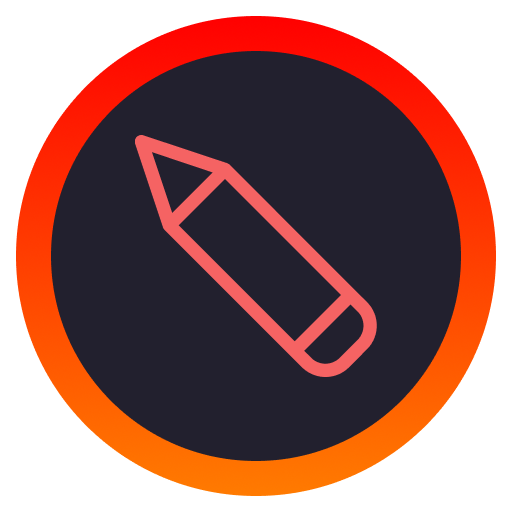

<p align="center">

</p>
<h1 align="center">Simple Screenboard</h1>
<p>
  

  <a href="https://github.com/maykbrito/screenboard/graphs/commit-activity" target="_blank">
    
  </a>

  <a href="https://twitter.com/maykbrito" target="_blank">
    
  </a>
</p>

> 👨🏾‍🏫 It's a simple overlay blackboard on your screen

## 🎉 Install

```sh
yarn install
```

## 🔥 Usage

```sh
yarn start
```

## 🍸 Build

If you want to use it as an app for your platform run

```sh
yarn run build
```

It will give to you an file ate ./packages directory

## ⌨️ Shortcuts

While it's running in your terminal, you can do a set of commands:

| Functionality         | Keyboard Shortcut         |
| -:                    | :-                        |
| **Toggle Window**     | Alt + Shift + w           |
| **Undo**              | Cmd or Ctrl + z           |
| **Redo**              | Cmd or Ctrl + y           |
| **Clear Canvas**      | Cmd or Ctrl + backspace   |
| **Select Line**       | q (draw a line)           |
| **Select Square**     | w (draw a square)         |
| **Select Brush**      | e (free hand draw)        |
| **Select Circle**     | r (draw an circle)        |
| **Select Text**       | t (type text)             |
| **Select Arrow**      | y (draw an arrow)         |
| **Select Hand**       | h (move canvas around)    |
| **Increase pen size** | =                         |
| **Decrease pen size** | -                         |
| **Select colors**     | a (red), s (green), d (blue), f (black), g (white) |

## 😢 Limitations

There are some limitations about the transparency on Electron. You can check out [here](https://www.electronjs.org/docs/latest/tutorial/window-customization#limitations).

On Windows OS:

* Transparent windows will not work when DWM is disabled.
* Transparent windows can not be maximized using the Windows system menu or by double clicking the title bar. The reasoning behind this can be seen on PR [#28207](https://github.com/electron/electron/pull/28207).

---

## 👨🏾‍💻 Techs

* Javascript
* HTML
* CSS
* Electron
* Node.js

## 👤 Author

**Mayk Brito**

* Website: <https://maykbrito.dev>
* Twitter: [@maykbrito](https://twitter.com/maykbrito)
* Github: [@maykbrito](https://github.com/maykbrito)
* LinkedIn: [@maykbrito](https://linkedin.com/in/maykbrito)

## 🤝 Contributing

Contributions, issues and feature requests are welcome!<br />Feel free to check [issues page](https://github.com/maykbrito/screenboard/issues).

## 🧪 Tested in

* MacOS

## ✨ Show your support

Give a ⭐️ if this project helped you!

---

## 📝 License

Copyright © 2024 [Mayk Brito](https://github.com/maykbrito).<br />
This project is MIT licensed.

***
_💜_
